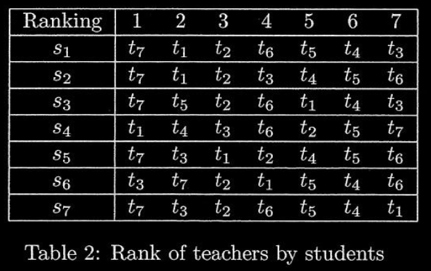

# 2013 Summer Written Exam
__Note:__ Seems like this exam had mistakes like question 3.2 and some unclear questions. So I did not solve everything.

## Question 1
### 1
`S={s1,s2...,sn}`, `T={t1,t2...,tn}` 
Number of pairs: `n!`
$n\cdot(n-1)\cdot(n-2)\cdot ... \cdot 1 = n!$
### 2
For every p-match only 4 out of 5 students can be satisfied at a time.
Because `s1, s3, s5` have the exact same preferred teachers (2), therefor only two of them can be satisfied for any p-match.

### 3
We will use **Edmond-Karp** algorithms (using BFS) to generate the max flow on a generated network from the bipartite graph of studnets and teachers.
- Step 1: Add $v$ and $u$ edges such that $V:(v,s_i).\forall i\in\{1,...,n\}$ and $U:(t_i,u).\forall i\in\{1,...,n\}$
- Step 2: Define $V: S \cup T$ Add capacity function $c_f : V \times V\rightarrow \{0,1\}$ capacity function. Also define $f(s,t).\forall (s,t)\in E\cup U \cup V$ the flow function.
- Step 3: Using Edmond-Karp we will find the max flow (by utilizing BFS).
- Step 4: At the end we will look at the edges $(u,v)\in E$ with positive flow, they will give us the p-match needed.
- Note: A residual graph will be created each iteration, with residual edges $(v',u')\forall (u',v')\in E\cup U \cup V$ where the capacity is 0 and the flow is $-f(u',v')$
- Complexity will be $O(|E|^2|V|)$ since any edge could be used the most $\frac{|V|}{2}$ times, thus $O(|E||V|)$ while the path selector will utilize all possible edges, meaning total of $O(|E||E||V|)\rightarrow O(|E|^2|V|)$

### 4

```
(s1, t1) -> 2
(s2, t2) -> 3
(s3, t5) -> 2
(s4, t4) -> 2
(s5, t7) -> 1
(s6, t3) -> 1
(s7, t6) -> 4
```
**The sum of the minumum rank is 15.**
- Lowest possible rank for `t1` is `1` but it occures for `s4` which is the only student which gives `t4` it's lowest possible rank.
- Lowest possible rank of `t2` is `3`.
- Lowest possible rank of `t3` is `1`.
- Lowest possible rank of `t4` is `2`.
- Lowest possible rank of `t5` is `2`.
- Lowest possible rank of `t6` is `4`.
- Lowest possible rank of `t7` is `1`.

### 5

```
(s1, t3) = 7, (t3, s1) = 3
(s2, t2) = 3, (t2, s2) = 2 
(s3, t4) = 6, (t4, s3) = 2
(s4, t7) = 7, (t7, s4) = 4
(s5, t5) = 6, (t5, s5) = 5
(s6, t6) = 7, (t6, s6) = 6
(s7, t1) = 7, (t1, s7) = 7
```
Is an `s-match` based on Table 2 and Table 3.

### 6
- Solving using the "Stable Marriage Algorithm".
- Step 1: The students will "propose" to their preferred teahers.
- Step 2: The teachers will tentatively choose from these proposals the top ranked and reject the rest.
- Step 3: The pairless students will propose to the next one on their rank list.
- Repeating steps 2+3 until everyone has been paired.
- Complexity: This will run in $O(n^2)$ time.

### 7
- Web reservation
- Database systems
- Secured online payment

## Question 2
__Note:__ Condition 3 is a little uncler so I am not sure this solution satisfies the condition.

### 1
Let us define a Half Adder with input A,B and output Sum,C for the sum and the carry. I will use the block `HA` to represent it.


The counter circuit would be:


### 2


### 3


### 4
TODO: I am not sure I understand the question and not sure what the solution is.


## Question 3
### 1
#### i
$(a,b)=a^{T}b=a_xb_x+a_yb_y+a_zb_z$
#### ii
$
(a,b)a=Ab\rightarrow 
\begin{bmatrix}
a_x(a_xb_x+a_yb_y+a_zb_z)\\
a_y(a_xb_x+a_yb_y+a_zb_z)\\
a_z(a_xb_x+a_yb_y+a_zb_z)
\end{bmatrix}=A\begin{bmatrix}
b_x\\
b_y\\
b_z
\end{bmatrix}$
$\rightarrow A=\begin{bmatrix}
a_x^2&a_xa_y&a_xa_z\\
a_ya_x&a_y^2&a_ya_z\\
a_za_x&a_za_y&a_z^2
\end{bmatrix}$
#### iii
<u>Note:</u> I did not understand the question, I am not sure what they want.

### 2
<u>Note:</u> "outer product" is an incorrect term. They mean cross product. Outer product is a mistake.

#### i
$a\times b= \begin{bmatrix}
a_yb_z-b_ya_z\\
b_xa_z-a_xb_z\\
a_xb_y-b_xa_y
\end{bmatrix}$

#### ii
$\mathbf{A}b=a\times b$\
$\rightarrow \mathbf{A}=\begin{bmatrix}
0&-a_z&a_y\\
a_z&0&-a_x\\
-a_y&a_x&0
\end{bmatrix}$
#### iii
$\mathbf{Q}=\begin{bmatrix}
a_x-1&a_x&a_x\\
a_y&a_y-1&a_y\\
a_z&a_z&a_z-1
\end{bmatrix}$
### 3
Assume: $y=\mathbf{P}x$ \
Let us use $\mathbf{P}=I-nn^T$ this means that:\
$\mathbf{P}x=(I-nn^T)x=x-nn^Tx=x-(n,x)n$

We know that $n$ is the norm, thus $||n||^2=1^2=1$, meaning that $\mathbf{P}x=x-\frac{(n,x)}{1}n$ Where $\frac{(n,x)}{1}$ is the scalar of projection $x$ over $n$.

So, $x-\frac{(n,x)}{1}n=x+(-1\cdot (n,x)n)$ is the addition of vector $x$ and a vector with direction opposit the norm with size as the projection of $x$ to $n$, which is exactly $y$.

Thus $y=(I-nn^T)x$.

### 4
#### i
$R_x(\theta _x)=\begin{bmatrix}
1&0&0\\
0&cos(\theta_x)&sin(\theta_x)\\
0&-sin(\theta_x)&cos(\theta_x)
\end{bmatrix}$
#### ii
- The angle $\alpha$ is the clockwise angle between $n$ and $X$.
- The angle $\beta$ is the counter clockwise angle between $n$ and $Z$.

And the equation describes 4 linear transformations (matrices). First to transform $n$ to have $y=0$, then to have $x=0$. Then there is the needed rotation around the $Z$ axis, and the reversed transformation to restore $n$.

## Question 4

### NP Complete: 
NP Complete is a group of problems who satify two conditions:
1. They are NP-Hard, meaning that they are the hardest problems in NP and finding a solution (brute force) cannot be done "quick". But given a solution it could be verified in relatively "quick" time.
2. Any other problem in NP can be reduced to it, including other known NP complete problems, such as 3-CNF-SAT.

A solution to any NP Complete problem would solve any other NP Hard problem. An example of NP Complete problem is finding the solution for Sodoku.

### Tail recursion:
This is a special form of recursion where the last operation of a function is a recursive call. Meaning that the value will be found and returned from the lowest recursion level.

### Step response and transfer function
In Control Systems a transfer function is the function which theoretically represents the system's output for any possible input. It receives an input and generates the output for the system. A step response is the evolution of the output over a small time step change.

### Discrete cosine transform (DCT):
In use with regards to compression. Is a transform function which is constructed with values from the Real domain. The function allows to "remember" only several values to construct the output. For example in compression, the "important" base values based on human perception. Which is why it is used in compression, such as: mp3, jpeg, mpeg and more.

### Public key cryptosystem:
A public key cryptosystem refers to an encryption of messages over a public channel, also known as an asymetric encryption. This encryption uses public keys and private keys for each of the sides in the exchange. Messages are encripted with the public key of the intended side but can only be decrypted with the private key. RSA is one such system which relies on the difficulty of factorization of a multiplication of very large prime numbers.

### DNS (Domain Name Service):
DNS is a service which allows the user to type web addresses in human (readable) language and arrive to the correct destination which is under an IP address. It redirects the user to the correct place, and functions like an address book and translation. When the specific DNS service in use does not know the address it sems a question to other DNS servers, this continues until a result is found.

### TLB (Translation Lookaside Buffer):
Used in regards to virtual memory. It is a special page table cache, which allows to make virtual memory access faster. It holds the translations from virtual address to actual address. The TLB is small and must be fast. It works just like a cache, storing page table data on "new" access and makes it accessible for next requests. 

### LL(1) parsing:
Related to cimpilers and compilation.