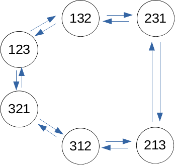

# 2015 Summer Written Exam

## Question 1
### 1


### 2
The state furthest from `123` is `213` and it requires at least **3 steps** to reach the ordered state `123`.


>`(213)->(312)->(321)->(123)`

### 3
There are three options, `(4231)`, `(2413)`, `(3142)` all of them take 4 steps to return to the initial state which is the maximum number of steps needed.

For reference, python code which calculates the whole states and steps (simialr to BFS).
```python
op = dict()

def calc(odr):
    qu = list()
    global op
    
    qu.append((odr,0))
    while len(qu) > 0:
        odr,d = qu.pop(0)
        if odr not in op:
            op[odr] = d
            odr_ex = odr[3]+odr[2]+odr[1]+odr[0]
            qu.append((odr_ex,d+1))
            odr_ex = odr[0]+odr[3]+odr[2]+odr[1]
            qu.append((odr_ex,d+1))
            odr_ex = odr[0]+odr[1]+odr[3]+odr[2]
            qu.append((odr_ex,d+1))

calc("1234")

for key in op.keys():
    print(key, "->", op[key])
```

### 4
A possible algorithm would be simialr to BFS. We would see each state as a node on a graph. The start state is the state we receive. We will implement a queue which we will insert elements to and pop them out. Each element, just like in BFS, will go into the queue when it is descovered and leave the quque when work on it is finished. for every element inserted into the queue we will perform a test to check if it is "ordered". Time complexity will be $O(n!)=O(n^2)$

1. Insert start-state into the queue
2. Run `while` the queue is not empty
3. Pop an element from the queue
4. Check if the element has been descovered before.
5. Check if the element is ordered-state
6. Otherwise, add three new states to the queue:
    * [4][3][2][1]
    * [1][4][2][3]
    * [1][2][4][3]
7. Repeat 2-6 until found ordered-state

## Question 2
### 1
Probability of arriving packet (in time interval `T[sec]`) on any line is $\lambda$. Therefore:

$p(0\space packets) = (1-\lambda)^3$

$p(1\space packet) = \lambda(1-\lambda)^2$

$p(2\space packets) = \lambda^2(1-\lambda)$

$p(3\space packets) = \lambda^3$

$\mathbf{E}(p) = \lambda(1-\lambda)^2 + 2\lambda^2(1-\lambda) + 3\lambda^3$

### 2
Probability transition matrix between two states of the buffer. **Rows** is the current state, **column** is the next state.
| |0|1|2|3|
|-|-|-|-|-|
|0|$(1-\lambda)^3$|$\lambda(1-\lambda)^2$|$\lambda^2(1-\lambda)$|$\lambda^3$|
|1|$(1-\lambda)^3$|$\lambda(1-\lambda)^2$|$\lambda^2(1-\lambda)$|$\lambda^3$|
|2|0|$(1-\lambda)^3$|$\lambda(1-\lambda)^2$|$\lambda^2$|
|3|0|0|$(1-\lambda)^3$|$1-(1-\lambda)^3$|

Example explanation, `2->1` In state 2, we have 2 items in the buffer which makes the buffer to take our to output line. So we naturally transition to state 1, but to maintain state one, we need that nothing will arrivbe on the input lines which is in probability $(1-\lambda)^3$.

### 3
Based on `Markov Chains`, to calculate correctly the expected state we need to define the probability $b(n)$ for the buffer to be in state `n`. Then the expectency would be:

$\mathbf{E}(b)=\sum_{n=0}^3n\cdot b(n)$

To calculate $b(n)$ we will use the properties of Markov Chains, more specifically when  the number of state transitions approaches infinity the state probability vector $Q$ would suffice the equasion $Q=MQ$ for $M$ transition matrix.

So starting with $Q=\begin{bmatrix}1 & 0 & 0& 0\end{bmatrix}$, $\lim_{n\rightarrow \infty}M^nQ$ would give us $Q_n=\begin{bmatrix}b(0)&b(1)&b(2)&b(3)\end{bmatrix}$.

This will allow us to calculate the expected number of items in the buffer.

### 4
To calculate correctly we will use the vector of probabilities $Q_n$ which we defined earlier. Also let us define the probability that the buffer lost a packet when having $d$ packets initially to be $L(d)$.

- $L(0) = 0$
- $L(1) = L(2)=L(3)=(1-\lambda)^3$

Since at any given point if a packet exists in the buffer it will be moved to the output line. Therefore:

$b(drop)=(1-\lambda)^3 \cdot (b(1)+b(2)+b(3))$

### 5
The following matrix describes the states of the buffer. Where `1` means one from input line 1, `2` means one from input line two. And `12` Indicates two elements one from input line 1 and another from input line 2. And `22` similar where two are from input line 2. And so on for `122` and `222`.
||0|1|2|12|22|122|222|
|-|-|-|-|-|-|-|-|
|0|$(1-\lambda)^2$|$\lambda(1-\lambda)$|$\lambda(1-\lambda)$|$\lambda^2$|0|0|0|
|1|$(1-\lambda)^2$|$\lambda(1-\lambda)$|$\lambda(1-\lambda)$|$\lambda^2$|0|0|0|
|2|$(1-\lambda)^2$|$\lambda(1-\lambda)$|$\lambda(1-\lambda)$|$\lambda^2$|0|0|0|
|12|0|0|$(1-\lambda)^2$|$\lambda(1-\lambda)$|$\lambda(1-\lambda)$|$\lambda^2$|0|
|22|0|0|$(1-\lambda)^2$|$\lambda(1-\lambda)$|$\lambda(1-\lambda)$|$\lambda^2$|0|
|122|0|0|0|0|$(1-\lambda)^2$|$\lambda(1-\lambda)$|$\lambda(1-\lambda)$|
|222|0|0|0|0|$(1-\lambda)^2$|$\lambda(1-\lambda)$|$\lambda(1-\lambda)$|


## Question 3

### 1
A possible system could the Time of Flight (ToF) type of system. These systems use the time it takes for a signal to leave the emitter and arrive to the receiver after being reflected from the object to calculate distance in 3d environment, and thus position. A possible ToF system could use `light` to calculate 3d-position.

Using a light ToF system, light which is emitted from a source will bounce back after arriving to the point and reach the receiver. The time it took the light to bounce back can be used to calculate the 3d position. More sofisticated system can detect x and y coordinates using the same methods on top of the z.

### 2
We will need a lense (receiver) a light source (point laser), and the light sensor to make the detection.

### 3
The system can work well in different environment, outside or inside and the light frequency can be near IR frequencies. Also humidity does not affect the results. But if the point is obscured by something else it cannot be detected.

### 4
The system works nearly as fast as the speed of light and can detect distances of a few centimeters to a few meters depending on the lens chosen for the system.

### 5
A possible application would be obstacle detection for factory robotics. Especially for shipment warehouses. Automation in stock handling lead to the need for robots to be able to avoid obstacles on their path.

## Question 4
### Superscalar
Superscalar processors have the ability to execute several instructions at the same time. This is an example of micro-parallelism. It is about finding groups of instructions which are unrelated to each other and can be run in parallel. Some of the disadvantage (groups of more than 2 instructions) include many possible hazards, more hardware needed and it is difficult to find these groups efficiantly. 

### Cross site scripting
Cross site scripting is one of the most comon volnerabilities in web applications. It is charictarized with the client browser running code (usually javascript) which could be harmful to the user through a volnerable web form. Some attacks could occure by clicking a link which executes malicious code on the browser. Some attacks may store code on the server and play it to many users.

### Support vector machine
SVM, used in machine learning. Is a mathematical algorithm to create a classifier based on training data. SVM work by getting data with certain dimensionality, converting the data to a higher dimensionionality using Kernels and finding a support vector classifier (soft margin) on the altered data. This will allow the classification of new data. SVM have more bias and less variance (in the bias-variance trade-off). in SVM the data is not actually computed into a higher dimensionality, but the Kernel-trick is used, this is the calculation of the relation between the points in higher dimensionality, without actually raising the dimensionality.

### Strain gauge
The strain gauge is a stress (stretch) sensor. It meassures deformation (tension, compression) on the material. With this sensor it is possible to measure weight applied to the object, so it  can be used to create scales. It measures the resistance (high/low) to determine tension or compression. 

### Half adder
The half adder is a logic circuit build from logic gates. This circuit is designed to take two binary numbers and add them together. Compared to the full adder, the half adder does not include a carry input and only the two numbers. The output would be the sum and the carry. 

This is the truth table for the half adder:
|A|B|A+B|Carry|
|--|--|--|--|
|0|0|0|0|
|0|1|1|0|
|1|0|1|0|
|1|1|0|1|

### Just-in-time compiler
The just in time compiler (JIT), compiles the code "just-in-time" for when you need to use it. The code is compiled method by method for when you will need each method. This combines the approach of traditional compilers and interpreters. 

### PWM (pulse width modulation) control
PWM control unit allows to control the pulse of the power supply to a curcuit. In LED lights for example this can create a dimming effect when the pulse is set to low. The pulse width can control the on and off time of the power supply. For example, 50% means that the power will be on 50% of the "time".

### Optical flow
Optical flow relates to image processing and it is about the process of understanding the motion within the image. By examination of the pixel level details. It can be used for video stabalization for example. Understanding the optical flow, can help understand the depth of the items as well. The optical flow model makes many asumptions for such calculations to happen, such as that the lighting does not change. 