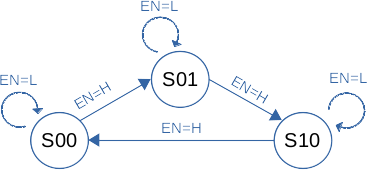
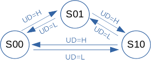
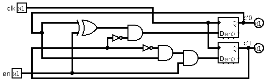
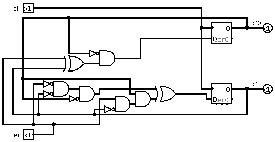
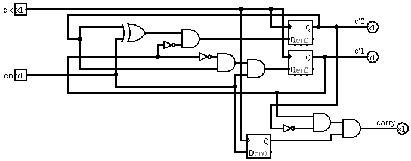
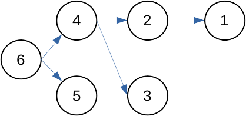

# 2016 Summer Written Exam

## Question 1

### 1

|befote| |input|after| |
|--|--|--|--|--|
|<u>*state*</u>|<u>*c*</u>|<u>*EN*</u>|<u>*state*</u>|<u>*c'*</u>|
|S00|0|L|S00|0|
|S00|0|H|S01|1|
|S01|1|L|S01|1|
|S01|1|H|S10|2|
|S10|2|L|S10|2|
|S10|2|H|S00|0|

### 2

|befote| |input|after| |
|--|--|--|--|--|
|<u>*state*</u>|<u>*c*</u>|<u>*UD*</u>|<u>*state*</u>|<u>*c'*</u>|
|S00|0|L|S10|2|
|S00|0|H|S01|1|
|S01|1|L|S00|0|
|S01|1|H|S10|2|
|S10|2|L|S01|1|
|S10|2|H|S00|0|

### 3
The following design uses NOT (A), AND (B), XOR (D), D-FF (E).
The outputs are `c'0` and `c'1` for the two bits.

### 4
The following design uses NOT (A), AND (B), XOR (D), D-FF (E).
The outputs are `c'0` and `c'1` for the two bits.

### 5
<u>Note:</u> I am not really sure if this is correct, it is a bit confusing what is expected.

This is the modified circuit from (3)

## Question 2

<u>Note:</u> I think they have a mistake in `Fig.1` since it is not possible by definition to have `Neighbor node` as 2 since `h(1,2)=3` and not 1.

### 1
Assuming:
- All nodes first send their existing table.
- After that all nodes handle the received tables.

The time until the tables converge is as long as the depth of the longest shortest rout between two nodes.

In the case of `Fig.2` the time is `3 minutes`

**For node 6:**

`T = 0`
|Dest.|#Hops|Neighbor node|
|--|--|--|
|6|h(6,6)=0|-|

`T = 1`
|Dest.|#Hops|Neighbor node|
|--|--|--|
|4|h(6,4)=1|4|
|5|h(6,5)=1|5|
|6|h(6,6)=0|-|

`T = 2`
|Dest.|#Hops|Neighbor node|
|--|--|--|
|2|h(6,2)=2|4|
|3|h(6,3)=2|4|
|4|h(6,4)=1|4|
|5|h(6,5)=1|5|
|6|h(6,6)=0|-|

`T = 3`
|Dest.|#Hops|Neighbor node|
|--|--|--|
|1|h(6,1)=3|4|
|2|h(6,2)=2|4|
|3|h(6,3)=2|4|
|4|h(6,4)=1|4|
|5|h(6,5)=1|5|
|6|h(6,6)=0|-|

### 2

### 3
- `L5, L6` are `500ms` and `1Mbps`.
- `L4, L7` are `50ms` and `100Mbps`.
- `L1-L3, L8-L10` are `1ms` and `1Gbps`.
- Num. of packets is 1000, size is 8Kbit.
- Path from node 6 to node 2, `(6)-L9->(4)-L4->(2)`.

**Let us define Transmission Delay $d_{tr}$ for `L9` and `L4`:**
- $d_{tr}(L9)=\frac{8\cdot 10^3}{10^9}=8\cdot 10^{-6}sec$
- $d_{tr}(L4)=\frac{8\cdot 10^3}{100\cdot 10^6}=\frac{8\cdot 10^3}{10^8}=8\cdot 10^{-5}sec$

**Let us note Propogation Delay $d_{pr}$ for `L9` and `L4`:**
- $d_{pr}(L9)=10^{-3}sec$
- $d_{pr}(L4)=5\cdot 10^{-2}sec$

<u>Note:</u> I am not sure what they meant in the question in regards to "ignoring" stuff. So I included the full calculation, but the answer could well be just `102sec` without the Packet Delay.

**The time $T$ It takes for the file to be transferred is:**
`2*(#packets)*(total packet delay + total transmission delay)`
$T_{total}=2\cdot 1000 \cdot(d_{tr}(L9) + d_{tr}(L4) + d_{pr}(L9) + d_{pr}(L4))$
$\rightarrow =2\cdot 10^3 \cdot(8(10^{-6}+10^{-5})+10^{-2}(5+10^{-1}))=$
$\rightarrow =2\cdot 10^{3}\cdot (\frac{8(1+10)}{10^{6}}+\frac{50+1}{10^{3}})=2\cdot 10^{3}\cdot (\frac{88}{10^{6}}+\frac{51\cdot 10^{3}}{10^{6}})$
$\rightarrow =2\cdot 10^{3}\cdot (\frac{88+51\cdot 10^{3}}{10^{6}})=2\cdot \frac{88+51\cdot 10^{3}}{10^{3}}=102.176sec$

### 4
One method to decrease the time T is to implement a rolling window of size $N$ where $N\leq \frac{k+1}{2}$ where $k$ is the number of packets.  

A rolling window will transmit packages in that window in order, when the receiver gets these packets it will send the approval. When an approval received the sender can move the window ahead by one packet at a time.

Assuming no errors (loss) in the system it allows to decrease the speed of transmition. If errors (loss) occures, there are mechanisms to handle that such as timeouts, window on the receiving side and such.

### 5
<u>Note:</u> Not sure if my answer is correct or sufficient.

One possible method would be the inclusion of delay (weight) for each rout and detecting the rout with the minimum delay (compared to number of hops). This will allow us to find faster routs instead of shortest routes. Which, in turn, will generate a lower T.

Another possible method would be including more routing options for each node, so instead of the "best route" only, an inclusion of second best will allow us to decrease T by (at most) 2, in case of parallelism. It is possible to divide the packets between the different routes and work in parallel on the transmission.

## Question 3
### 1
Instead of $L(\theta, \phi)$ let us use $L(\phi)$ as per assumption.

$I=\int_{0}^{2\pi}\int_{0}^{\frac{\pi}{2}}L(\phi)\cos\theta \sin \theta \space d\theta d\phi$

$\space\space =\int_{0}^{2\pi}L(\phi)({0.5\sin^2\pi/2 - 0.5\sin^2 0})\space d\phi$

$\space\space =\int_{0}^{2\pi}L(\phi)({0.5(\sin^2\pi/2 - \sin^2 0)})\space d\phi$

$\space\space =\int_{0}^{2\pi}L(\phi)({0.5(1 - 0)})\space d\phi$

$\space\space =\frac{1}{2}\int_{0}^{2\pi}L(\phi)\space d\phi$

### 2
$I\approx\sum_{i=0}^{N}{L(\phi_i)(\phi_{i+1}-\phi_i)}=$

$\space\space\space\space\space\space\space
\sum_{i=0}^{N}{L(\phi_i)(\frac{2\pi}{N} (i+1-i))}=$

$\space\space\space\space\space\space\space
\sum_{i=0}^{N}{L(\phi_i)(\frac{2\pi}{N})}=
\frac{2\pi}{N}\sum_{i=0}^{N}{L(\phi_i)}$

### 3
The Monte Carlo method denotes that the relation in a large number of points between ones which are closed by the function and the total number of points times the generation area can correlate and approximate the integration of that function.

In other words, when randomly generating N points:

$Area\cdot N_{in}/N\approx \int f(x)dx$

**In our case on the range $[0,2\pi]$:**

$I\approx (1-0)(2\pi-0)\frac{1}{N}\sum_{i=1}^{N}{L(\phi_i)}=$

$\space\space
=\frac{2\pi}{N}\sum_{i=1}^{N}{L(\phi_i)}$

### 4
For case (2) because of the symetry of a rectangle the method will result in zero error for $L(\phi)$ such that the function over $[0,\pi]$ is the mirror of $(\pi,2\pi]$.

For case (3) a linear $L(\phi)$ will give the best result since the expected value $\frac{1}{N}\sum_{i=1}^{N}{L(\phi_i)}$ would give the value $\frac{L(2\pi)-L(0)}{2}$ which means that half of the function points are lower and half are larger. In a linear function this will make a correct summation based on the properties of a rectangle.

### 5
Based on the implementation with `32 bit` number, the way floating points are implemented means that there is a limit to the amount of digits which can be represented in the floating point number. This means that with a large enough pool of $N$ points an **overflow** may occure during the summation and thus the issue described with the result may happen.

## Question 4

### Kinematic and inverse kinematic
Used in robotics, kinematics is the study of motion, but without considering the cause of the motion. Inverse kinematics is the use of kinematic equations to determine the motion of a robot to reach a desired position. For exampel to perform automated package handling. The configuration used by inverse kinematics is the joint positions, for example, of the robot.

### Implementation method of force control
Used in robotics. Force control systems are designed when a precision control over the force of the end-effector is needed (as opposed to kinematics). The force controller meassures the force/torque applied on the end-effector and can be used to control the motion based on the data. an implementation of this could be done with strain gauges and a dedicated software to control the motion.

### Invariant features
Used a lot in machine learning based techniques. Invariant features are a set of features extracted from the data which do not change under different circumstances. Some features could be partially invariant, that is, invariant for some circumstances such as scale-invariant or roation-invariant features. Because invariant features are unaffected by manipulation of the object or the observer, they are powerful cues for object recognition by humans or machines.

### Backpropagation
Related to machine learning. Stands for "backward propagation of errors". It is an algorithm for training feed-forward neural networks. And generalization of backpropogation exists for other types of neural networks. This algorithm is used in supervised learning and it uses gradient descent. The idea is when given a neural network and an error function, the method calculates the gradient of the error with respect to the weights of the network.

### Autocorrelation function and power spectrum
Related to communication systems. Autocorrelation function is the expected value of a multiplication of two random value points of a frequency over two time points $t1$ and $t2$. More specifically, in stationary systems, the value at time $(t)$ and $(t+\epsilon)$. the Fourier transform of that is the power spectrum, it is the average power used as a function of frequency.

### Synchronous and asynchronous circuits
Synchronous circuits are type of logical circuits which are using the clock as the driving mechanism. Meaning that all elements are working synchroniously with the rise of the clock signal. They run slower and the status of the memory is affected only according to the clock frequency if the input is changed. On the other hand asynchronous circuits, are more difficult to design and include elements with no relation to the clock, they work faster and the memory elements will change as "soon" as the input is changed.

### An example of network security protocol
An example of a network security protocol is the `SSL` protocol. This is a type of a `Secured HTTP` protocol. It uses public-key private-key cryptography and signatures. Each website which uses `SSL` will start communication by sending its certificate to be verified and approved by the end user. Then communication is encrypted with the public key and decrypted with the respective private key. It uses large prime numbers and the multiplication of large prime numbers, as well as the difficulty of deconstructing a large number (created by multiplying prime numbers) to its dividers.

### Real-time property
<u>Note:</u> I think this refers to real-time computing but I am not sure.

Real time property is the property of a computing system to react in "near" real time to requests, in order of milliseconds or even microseconds. These response constraints are referd to as "deadlines". The time which takes a system from event to response must obide by the time constraints of a real-time system.