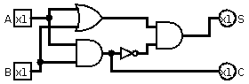
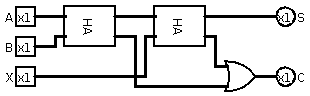
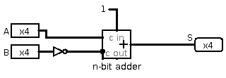
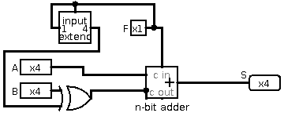
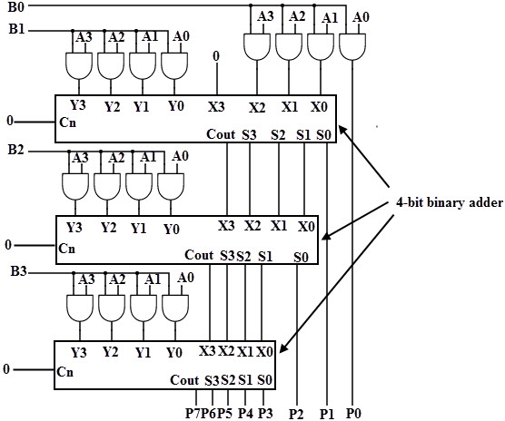

# 2017 Summer Written Exam

## Question 1
<u>Note:</u> My solutions from section (3) onward uses a slightly different calculation from that in (1). Which allow to find the best path by seleting the highest valued option up or right on the weighted $V(s)$ table. Their definitions are confusing and weird.
### 1
$\begin{bmatrix}
-1&0&0\\
3&0&0\\
3&2&0
\end{bmatrix}$

### 2
$\begin{bmatrix}
\rightarrow&\rightarrow&G\\
\uparrow&&\\
S&&
\end{bmatrix}$

### 3
$\begin{bmatrix}
0&2&0&0&0\\
6&4&\mathbf{x}&10&-5\\
8&6&\mathbf{x}&10&-10\\
10&10&10&10&-15
\end{bmatrix}$

### 4
$\begin{bmatrix}
&&&\rightarrow&G\\
&&\mathbf{x}&\uparrow&\\
&&\mathbf{x}&\uparrow&\\
S&\rightarrow&\rightarrow&\uparrow&
\end{bmatrix}$

### 5
Let us denote $P_{ss'}^a$ as the probability that the robot moves $s\rightarrow s'$ by order $a$. Then:

$W(s)=\sum_{a\in up,down}{P_{ss'}^a\cdot (R_{ss'}^a+W(s'))}$

### 6
$\begin{bmatrix}
0&2&0&0&0\\
5.2&4&\mathbf{x}&9&-5\\
7.8&6&\mathbf{x}&7.2&-10\\
7.3&5.3&2.7&2.7&-15
\end{bmatrix}$

### 7
$\begin{bmatrix}
&\uparrow&\rightarrow&\rightarrow&G\\
&\uparrow&\mathbf{x}&&\\
\uparrow&\rightarrow&\mathbf{x}&&\\
S&&&&
\end{bmatrix}$

### 8
The difference comes from the new probability which was introduced. The new function $W(s)$ calculates for each cell the probability of the score of the route starting from that cell to the goal. The suggested route is the route with the highest score probability. Since the robot might "choose" with 20% probability a different route from the suggested one. The suggested route should maximize the probability for a high score, whatever the choice was by the robot.

## Question 2

### 1
|A|B|S|C|
|-|-|-|-|
|0|0|0|0|
|0|1|1|0|
|1|0|1|0|
|1|1|0|1|

### 2

### 3
|A|B|X|S|C|
|-|-|-|-|-|
|0|0|0|0|0|
|0|0|1|1|0|
|0|1|0|1|0|
|0|1|1|0|1|
|1|0|0|1|0|
|1|0|1|0|1|
|1|1|0|0|1|
|1|1|1|1|1|

### 4

### 5
A method would be to do a bitwise addition for $A=a_0a_1a_2a_3...a_n$ and $B=b_0b_1b_2b_3...b_n$ two unsigned $n$ bit integers. And the carry of each addition would be connected to the `X` input of the following FA. Thus $FA_0$ has `a0,b0,_` as inputs, $FA_1$ has `a1,b1,c0` as inputs and so on.

### 6
A faster method would be to build a look-ahead carry adder. This adder basically computes the values with consideration to the carries without calculating the carry and waiting for the result of each pair to calculate the next result. Since each calculation can be expanded to use parameterization without the carry, it is possible to remove internal carries. 

### 7
Subtraction would be an addition with the negative value. So let's assume we would like to calculate `A-B`, it is the same as computing `A+(-B)`. This means that for subtraction all we need to do is compute the 2's-complement of `B` and add the two numbers together. This can be acomplished by inverting `B` and adding `1` to the `X` (carry) input of the n-bit adder.

*Note: Example uses 4-bit but same drawing is for n-bit.*

### 8
A method could be to use `F` as the input to the carry of the n-bit adder. As well as XOR `F` and every bit of `B`. This way, If `F=1` meaning subtraction, `B` will be inverted and 2's complement will be implemented with the adder carry. Otherwise `B` will stay the same and addition will be implemented.

### 9
A method to compute multiplication would be using full adders and half adders in the following way:

Notice that the Truth Table of bits `a*b` is the same as `a&b`. Avery `bi` is multiplied by the whole of `A` and the solution is added between two consecutive `bi` and `bi+1`.

This method is very similar to the multiplication algorithm that is being tought in schools.

## Question 3

### Wavelet transformation
In signal processing. The Fourier transform help isolate and recognize stationairy signals. The Short Time Fourier transform uses a rolling window of fixed size to add the time domain to the process and assist with non-stationairy signals. But for STFT a narrow window will have good time resolution but poor frequency resolution, while a wide window will have poor time resolution and good frequency resolution. The Wavelet transform improves on these ideas and uses a wavelet with changable "size" as the basis function. It is possible to change the width and central frequency of the wavelet, i.e. "scaling". 

### Cepstrum
The Cepstrum is essentially the spectrum of the spectrum and is defined generally by $C(x(t))=F^{-1}[log[F(x(t))]]$. Where $F$ is the Fourier transform and $F^{-1}$ is the inverse Fourier transform, for a signal $x(t)$. This concept is used a lot in speech recognition (with the cosign transform to replace Fourier).

### Deep Learning
Deep learning is a type of machine learning algorithms group which is defined by a neural network type of architecture. This architecture "mimics" the way the human brain works in relation to pattern recognition. Each network in comprised of layers of inner nodes, and uses algorithms such as Backpropogation with relation to an error function for the act of "learning".

### ZMP (Zero Moment Point)
(Also explained for 2014-Summer exam)

The ZMP is a concept which is used in robotics and especially with walk/run/jump actions. For a stable body it needs $velocity=0$ but on top of that it also needs $momentum=0$. Meaning, that the inertia of the body is 0, otherwise it would develop speed. The ZMP is the point with relation to the center of mass (CoM) which would give zero momentum and make the body stable.

### SSL (Secure Socket Layer)
In networking, SSL is a security mechanism which enables an encrypted connection between a client and a server. It works by a mutual "handshake" between the client and the server through authentication of certificates. The connection itself is using the public-key private-key encryption (prime numbers and modulation) to encrypt the communication.

### Targeted e-mail attack
Targeted email attack is an attack which the attacker targets though the email channel, and tries to persuade a victim to run specific actions. Some actions could be: opening a link, downloading an attachment or installing software. The motives behind such attacks could be stealing information, gaining control of the target machine and more.

### Hough transform
The Hough transform is used in computer vision in regards to edge/shape detection. It is a very powerful algorithm which is insensitive to noise and disconnected lines/edges. This algorithm works in another parameter space which is not the image space and uses "voting" over a vote matrix to determine the edges. In the general case, given the $\phi$ table of a shape we can detect this shape in an image.

### Lambda expression in computer programming
In programming languages `lambda expressions` are a tool used to define inline functions. These functions do not need to have headers and are defined inline. An example for one use of lambda expression could be when a sorting algorithm requires a function which given two objects outputs `-1,0,1` depending on which is larger.