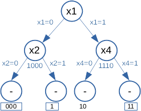

# 2018 Summer Written Exam

## Question 1
### 1 
<u>Note:</u> I am not sure what is $_nC_k$ since it is not defined anywehre. So the meaning of $log_nC_k$ is completely unclear.

### 2
Let us fine a $\theta$ such that the least squares is minimized. Let us denote least squares as $f(\theta )$.

$f(\theta )=\sum_{t:x_1=1}(y(t) - \theta )^2$

$f(\theta )=(1 - \theta )^2+(1 - \theta )^2+(1 - \theta )^2+(0 - \theta )^2$

$f(\theta )=3(1 - \theta )^2+(- \theta )^2$

$f'(\theta )=-6+6\theta +2\theta = 0$

$\space\space\space\space\space\space\space\rightarrow
8\theta = 6 \rightarrow \theta=\frac{3}{4}$

Therefore, when $\theta = \frac{3}{4}$ the least squares function is minimized.

### 3
|$i$|1|2|3|4|
|-|-|-|-|-|
|$y_0$|1000|11000|110|1100|
|$y_1$|1110|110|11000|1100|

<u>Note:</u> I did not understand `Eq.1` so it is difficult to answer this part. But it seems that for $i=1$ the value of $x_1$ has great affect on the classification.

### 4
<u>Note:</u> Any mistakes here are derived from the issues with `(1)` mentioned before.

### 5
In machine learning there are the concepts of bias and variance. The bias indicates how much the generated prediction function fits the relationships between the data and the prediction. And variance indicates how much the prediction function fits "new" data (testing data). When the prediction function fits the training data too well it is called **"over fitting"** and over fitting leads to low bias but high variance. In the mentioned case, extending the tree would result in over fitting the prediction function to the data set. Meaning that on new data the variance will be large and it will not improve the overall prediction.

### 6
Assuming set `S` is independent from the training set that was used to generate the tree `T`.

The algorithm will work as Minimum Error Pruning technique. It will work from the bottom up. For every bottom level node (only child nodes are leafs), calculate the error after pruning, meaning that the leaves are discarded and the node becomes a leaf with prediction being:
- 1 if $\#_{y=1} \gt \#_{y=0}$
- 0 if $\#_{y=0} \gt \#_{y=1}$
- 1 if $\#_{y=0} = \#_{y=1}$

If the error is smaller on the set `S` compared to the tree prior to pruning, prune the tree and continue to the next candidate. 

The algorithm will work on at most $O(N_I(T))$ nodes and for each node it will calculate the error for that tree which takes $O(|S|)$, together $O(N_I(T)\cdot S)$

The algorithm will stop when pruning all bottom level nodes do not lead to a decrease in the error.

## Question 2
<u>Note:</u> I never learned kinematics and physics in my degree, I have no prior knowledge before attempting to solve this question.
### 1
Assuming $f(t)=F$ is **constant force** and not accelaration, for $t\in [t_0,t_1]$. Then:
1. Gravitational force: $M\cdot g\cdot sin(\theta)$ over the horizontal line.
2. Net accelaration force: 

$f_{net}(t_1)=\sum \mathbf{f}=F-M\cdot g \cdot sin(\theta) \to M\cdot a_x =F-M\cdot g \cdot sin(\theta)$
$\space\space\to
a_x =\frac{F}{M} - g\cdot sin(\theta)$

3. **Velocity:**

$v(t_1)=v(t_0)+\int_{t_0}^{t_1}a_x\space dt = (\frac{F}{M} - g\cdot sin(\theta))\cdot t_1$

4. **Position:**

$x(t_1)=\frac{1}{2}(v(t_0)+v(t_1))\cdot (t_1-t_0)=\frac{1}{2}(\frac{F}{M}-g\cdot sin(\theta))\cdot (t_1)^2$

### 2
Net accelaration force $[t_1,t_2]$:

$a_x =-\frac{F}{M} - g\cdot sin(\theta)$

$v(t_2)=v(t_1)-(\frac{F}{M} + g\cdot sin(\theta))(t_2-t_1)=0$

$x(t_2)=\frac{1}{2}\cdot (v(t_1)+v(t_2))\cdot (t_2-t_1)=\frac{1}{2}\cdot v(t_1)\cdot (t_2-t_1)=L$

By solving Eq. $v(t_2)$ and $x(t_2)$ a solution can be found.

<u>Note:</u> I cannot solve the rest because of lack of knowledge in the subject.

## Question 3

### Pipeline hazard
Pipeline hazard refers to a situation where dependencies in a program result in incorrect execution on the pipeline architecture. There are several types of hazards:
1. **Structure hazard** - Occures when two commands attempt to access the same memory component at the same time.
2. **Data hazard** - Occures when a command attempts to use data which has not been finalized yet.
3. **Control hazard** - Occures when executing a command results in an unwanted jump in the flow of commands (harms the natural order of execution).

### Register renaming
Register renaming is a process which helps solve data dependency hazards. The concept is about seperating the architectural registers (which the program uses) with the physical registers (which exist in the machine). Register renaming rewrites the program to use physical registers based on the actual allocation of the value at that moment. It uses a table called Register Allocation Table (RAT), which tells which physical registers hold the value of the architectual registers at a given moment. It maximises the prediction by comparing the past estimations with the actual meassured readings and adjusts accordingly.

### Kalman filter
Kalman filters, used a lot in signal processing, guidance and location estimation, computer vision and others. It is an optimal estimation algorithm, in situations with even noisy meassurements. It uses probability and estimation over the noise and disturbances to generate an optimal estimation. 

### Regular grammar and regular languages
A regular language is a language over a regular grammer which there exists a finite state automata which accepts it. A regular grammer is defined by $G={V,T,S,P}$ where:
- $V$ are variables or non terminal symbols.
- $T$ are terminal symbols.
- $S$ is a start symbol.
- $P$ is the production rule for all symbols.

### Public key cryptography and certification authority
Public key cryptography refers to a type of security mechanism for a secured message exchange over a public channel between two entities. It uses a private key for each side and a shared public key. The method takes advantage of the difficulty to guess the decomposition of a large number which was a composition of two large prime numbers, as well as modulu operation. The certification authority refers to an entity which can authenticate the trust of a web entity. It is used in regards to SSL for example where a web provider issues a certification with the authority for a secured connection between it and the client. The client uses the certification authority to validate the certificate of the service.

### Traveling salesman problem
A classic problem in computer science, which describes a travelling salesman who wants to get the shortest path through all cities and back to the start. Let our cities be ${a,b,c,d}$ a possible path would be $a\rightarrow b \rightarrow c \rightarrow d \rightarrow a$. This is an NP-hard problem which cannot be solved in polinomiyal time. Some heuristic solution exist which reduce the runtime but may not find the optimal solution.

### Divide and conquer method
Divide and conquer approach refers to an approach in algorithms where for a given problem, you split it into equally sized problems, solve these and combine the solution to solve the bigger problem. An example of a divide and conquer algorithm is Merge Sort. For `N` elements, you divide into two sets of `N/2` (or `N/2 + 1`) elements and combine the solutions.

### Vector quantization
Used in compression algorithms. Vector quantization refers to the process of assigning representatives (codewords) to groups of vectors based on distance. Such that $V_i(x)=\{y_i:||x-y_i||<||x-y_j||\space for\space j\neq i\}$ for $x\in R^k$ vector of dimension $k$. This allows to generate a lossy compression when used. Vector quantixation defines an encoder, decoder and a codebook to generate the codeword domain.
