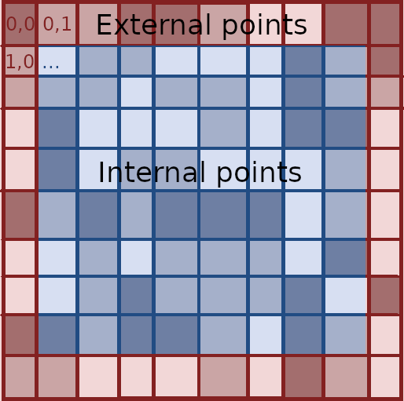
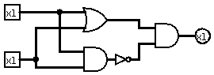
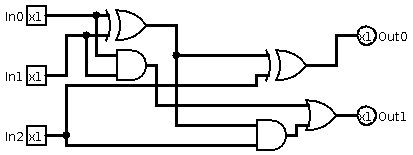
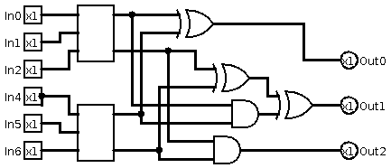

# 2019 Summer Written Exam

## Question 1
### 1
Grayscale image, represented by $n\times n$ array of names `P` of `Pixels`. Each pixel `p` has `p.brightness` which is a 256-level value.

<u>Algorithm:</u>

Given a group of points `G` and a given point `p=(i,j)` we will check on a copy of the points:
1. If the current pixel does not exists in the remaining group we return 0.
2. Else, we mark it as visited (change the brightness to 0 for example).
3. We will call on all neighbores we find recursively with the modified data (the visited point).
4. we will add the number found by the recursion to 1 and continue.

Since it the part is strongly connected we will find all the number of pixels in the group.

- `P`: a copy of the array, by reference
- `pi`, `pj`: index i and j of the current pixel
- `th`: the threshold
```
function size_of_area(P, pi, pj, th):
    if P[i,j].brightness < th:
        return 0
    P[i,j].brightness = 0
    val = 1
    i = -1
    while i < 2
        j = -1
        while j < 2
            if i == 0 and j == 0:
                continue
            val = val + size_of_area(P, pi+i, pj+j, th)
            j = j + 1
        i = i + 1
    return val
```

Time complexity would be $O(n)$, since we go over all pixels once at most.

### 2
Using Single Source Shortest Path algorithm we will find the weight of the shortesdt path from `p1` to `p2`. Given the assumptions all weights are non-negative thus we can use the Dijkstra algorithm.

Let us define:
- `PQ`: minimum pariority queue of `(key, value)` where key is the pixel and value is the shortest path to it. 
- `W`: weight array for all pixels.

```
function lowest_sum_of_connection(P, p1, p2):
    PQ = [(p1,p1.brightness)]
    W = [inf] // array with weight infinity
    prior = [null] // array with prior pixels of the shortest path

    while PQ not empty:
        p0 = PQ.pop() // lowest value (key,value) pair
        i = -1
        while i < 2:
            j = -1:
            while j < 2:
                if i == 0 and j == 0:
                    continue
                if p0.j+j < n or p0.i+i < n:
                    continue
                if W[p0.i+i,p0.j+j] > p0.value + P[p0.i+i,p0.j+j].brightness:
                    PQ.insert((P[p0.i+i,p0.j+j], p0.value + P[p0.i+i,p0.j+j].brightness))
                    prior[p0.i+i,p0.j+j] = p0
                j = j + 1
            i = i + 1

        if p0 == p1:
            return W[p1.i, p1.j]

```
Time complexity is $O(n^2\cdot log\space n)$ since there are at most $O(n^2)$ inserts to the PQ and each insert takes $O(log\space n)$.

### 3
Similarly to (2) we the SSSP algorithm, but we will create an new start pixel `s` which will have brightless set to 0 and is connected with all pixels in the first row. 

```
function best_vertical_partition(P):
    PQ = [(s,0])]
    W = [inf] // array with weight infinity
    prior = [null] // array with prior pixels of the shortest path

    i = 0
    while i < n:
        PQ.insert((P[0,i],P[0,i].brightness))
    while PQ not empty:
        p0 = PQ.pop() // lowest value (key,value) pair
        i = 1
        j = -1
        while j < 2:
            if p0.j+j < n or p0.i+i < n:
                continue
            if W[p0.i+i,p0.j+j] > p0.value + P[p0.i+i,p0.j+j].brightness:
                PQ.insert((P[p0.i+i,p0.j+j], p0.value + P[p0.i+i,p0.j+j].brightness))
                prior[p0.i+i,p0.j+j] = p0
            j = j + 1
    
    best_p = min(P[n,j]) // for 0 <= j < n
    return path_from_prior(prior, best_p)
```
Time complexity is as before $O(n^2\cdot log\space n)$

### 4
<u>Note:</u> I truly am not sure I understood this question correctly, the definitions are not clear and something is off so I don't know how good is my solution.

Assuming an image such as the internal points (blue) are all pixels in range $(i,j),\space i\in[1,n-2],\space j\in[1,n-2]$. And the external points (red) are on the edges of the pixel matrix.



We define $x'=\frac{1}{8}\mathbf{A}x+\frac{1}{8}\mathbf{B}b$ for vectors $x$ and $b$. Such that:
- $\mathbf{A}$ is a ${0,1}$ matrix of dimension $(n-2)^2\times (n-2)^2$ which every row defines which values from $x$ will participate in the value for $x'$
- $\mathbf{B}$ is a ${0,1}$ matrix of dimension $(n-2)^2\times 2(2n-2)$ where each row defines which elements from $b$ will participate in $x'$

### 5
When the method in (4) is repeated, since the values of $b$ never change or update in a case where $b$ is not all `zero` the values of $x'$ will converge to $x^{inf}$.  Since $b$ does not change, the values will propogate through all internal pixels. When $b=\mathbf{0}$ $x'$ will converge to $\mathbf{0}$


$x^{inf}=\frac{1}{8}\mathbf{A}(\frac{1}{8}\mathbf{A}(...(\frac{1}{8}\mathbf{A}x+\frac{1}{8}\mathbf{B}b)...)+\frac{1}{8}\mathbf{B}b)+\frac{1}{8}\mathbf{B}b$

$x^{inf}=\frac{1}{8^{\infty}}\mathbf{A}^{\infty}x+\sum_{i=0}^{\infty}{\frac{1}{8^{i}}\mathbf{A}^{i}}\frac{1}{8^{i}}\mathbf{B}b$

## Question 2

### 1
```
k = 0
i = 0
while i < 32:
    k = k + (1 & n) // (2 time units)
    n = n >> 1 // shift to the right (1 time unit)
    i = i + 1
return k
```

Time complexity would be $O(n)$ in the general case since we go over every indicator once. In this case since $0<n\leq 32$ then it will be $O(1)$. Exact computation time would be $32\cdot 3=96$ units of time.

### 2
In the case where we use lookup tables we can save the shift operation. This means that the computation time would be: $32\cdot 2=64$ units of time.

### 3
```
k = 0
i = 1
while i < 2**32:
    k = k + (i & n) // (2 time units)
    i = i << 1
return k
```

In this method we take only $32\cdot 2=64$ units of time as (2) but we use less space than with a lookup table. We took advantage of the loop indicator as the mask for the logical `and` operation.

### 4
Let us use AND, OR and NOT to define a new gate called XOR.



Using XOR, AND, OR and NOT we will creatre `P3` as follows:



The truth table for it would be:

|In0|In1|In2|Out0|Out1|
|-|-|-|-|-|
|0|0|0|0|0|
|0|0|1|1|0|
|0|1|0|1|0|
|0|1|1|0|1|
|1|0|0|1|0|
|1|0|1|0|1|
|1|1|0|0|1|
|1|1|1|1|1|

### 5
For `P6` the logic will be as follows:



### 6
<u>Note:</u> I am not sure about my answer, I think propogation delay is correct but not sure. The question itself isn't clear as well. Should I solve the latency problem or give a reason. Not clear.

Since any of the $n/3$ elements could contribute to the actual sum, there would be a large number of gates which need the data from the last gates available. That is, there would be many in-line gates which would need to wait for the correct value to propogate forward.

## Question 3

### Inverse kinematics
Inverse kinematics is the usage of kinematic equasions to determine the motions of a robot in order to reach a desired position. Kinematics itself is the study of motion regardless of the cause of the motion, such as forces and torques. Use cases can include the motion of picking bins or items from the assembly line. Given a starting joint position and a desired position, inverse kinematics can determine the join movement needed to achieve that.

### Hidden Markov model
Hidden Markov model is a statistical model based on Markov chains which describes a situation where there exists hidden states and observed states. A correlation is assumed on the visible states regarding the hidden states. Given a sequence of states (visible), the Markoc model helps us calculate the hidden state sequence with the highest probability. It is used a lot in NLP, speech recognition and computer vision.

### MinMax algorithm
In computer science MinMax (a.k.a MiniMax) algorithm is an algorithm for choosing the "best" move to make in a game given a score on any state of the game board. Player 1 has a goal of maximising the score value while Player 2 attemps to minimise the score value (when Player 1 is the active player). The MinMax algorithm uses a tree-like stracture where all possible moves of a player are the child nodes. The tree ends in a leaf if either the game has finished or a certain depth was reached when it is defined. the current player (Player 1) will choose the next move where the highest score was achieved. An alteration to the algorithm to save of computation is called AlphaBeta Pruning.

### NP complete problem
NP complete problem is defined based on the followeing criteria:
1. It is NP hard, meaning that any algorithm will not run in polinomiyal time.
2. Any other problem in NP is reducable to it.

One such problem which is NP-complete is the 3-CNF-SAT problem which given a 3-CNF, need to find if there is a setting where the the 3-CNF is satisfied. Another NP-complete problem is finding a maximal clique in an undirected graph. Given an undirected graph, want to find the maximal clique in the graph.

### Ray tracing
Ray tracing is a process which attempts to approximate natural light in the physical world. It calculates light bounces from object to object by tracing the light ray, when the ray intersects with an object it affects color, reflections and so on, bounces and continues. Compared to the real world, instead of all light emmited rays being examined when reaching the "eye", the model is reversed and rays are being "shot" from the "eye" (the camera) to the objects.

### SIMD (Single Instruction Multiple Data)
In computer architecture SIMD is a type of architecture which refers to the ability to use a single instruction on multiple data elements at the same time. This is a sort of parallelism capability which enables faster overall computation. Is it helpful in 3D graphics, 3D physics, image processing, signal processing, media encoding/decoding and more. 

### Call by value and call by reference
In programming languages there are two different approaches to passing argument to a function. Call by reference means that a reference to the object is passed and any changes done internally in the function will also be visible outside of the function. On the other hand call by value refers to functions which get a copy of the data which is independant from the original data and any changes done in the functions will not remain after the function has finished its execution.

### Public key cryptography
Public key cryptography refers to an encryption and security algorithm which uses a public key and a private key to secure a communication between two sides. Each side has a private key which is not revealed and a public key which is known. This method relies on the difficulty of decomposing a number which is the result of a multiplication of large prime numbers, as well as the traits of modulu operations. An example of such an encryption is the RSA encription.