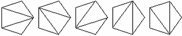
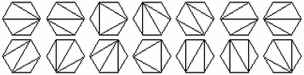
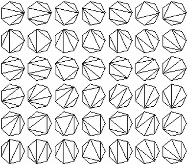
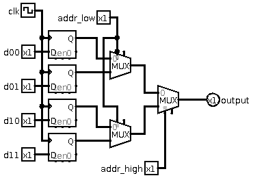
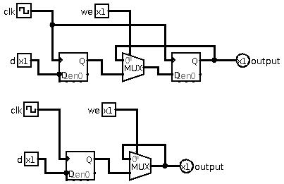
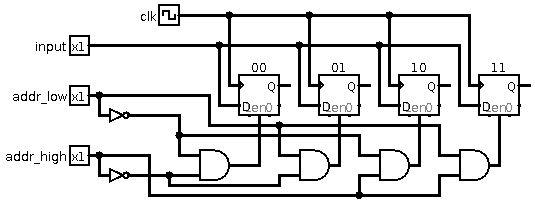

# 2020 Summer Written Exam

## Question 1
### 1
`C[4]=2`, `C[3]=1`, `C[2]=1`

`C[5]=5`



`C[6]=14`



`C[7]=42`



### 2
Based on the representation we can see that: \
$C[N] = C[2]\cdot C[N-1]+ C[3]\cdot C[N-2]+...+C[3]\cdot C[N-2]+C[2]\cdot C[N-1]$ \
$C[N]=\sum_{i=2}^{N-1} {C[i]\cdot C[N-i+1]}$

### 3
To complete the code we must add:
```
C[i] = C[i] + C[j+2]*C[i-j-1]
```
This will allow the sum to equal the equation found in (2).

### 4
Based on the assumptions: \
$E[i,m]=E[i,i'-i]+E[i'+1,m-(i'-i)]+D(i,i')+D(i',i'+1)+D(i'+1,i)$ \
Basically, we choose an arbitrary triangle $(i,i',i'+1)$ and using the fact all the other information is known. Then we look at the cost of the shape left of the triangle and right of it and combine with the cost of the triangle itself.

### 5
The following cose assumes (based on no. 4) that $E[i',m']$ and $D(i,j)$ are given.
```
minimum_cost = +infinity
for (i=1...n-2)
    local_cost = E[0,i+1]+E[i+1,n-i+1]+D(0,i)+D(i,i+1)+D(i+1,i)
    minimal_cost = min(local_cost, minimal_cost)
return minimal_cost
```
In this code we go over all possible divisions of the shape n-gon into 2 subshapes and compute the minimum for these with the addition of the dividing edge. This uses the formula acquired in (4).

The time complexity for this, assuming that the information is known as stated in (4) is $O(n)$.

## Question 2
### 1
|a|b|s|MUX|
|-|-|-|-|
|0|0|**0**|0|
|0|0|**1**|0|
|0|1|**0**|0|
|0|1|**1**|1|
|1|0|**0**|1|
|1|0|**1**|0|
|1|1|**0**|1|
|1|1|**1**|1|

### 2


### 3
Given the circumstances, we would need:

$\sum_{i=1}^{n} {2^{n-i}}=2^n - 1$

Since we gradually divide all inputs into 2 as inputs to the MUX, so the first layer would be $2^{n-1}$ the second $2^{n-2}$ and so on, until we have $2^{n-n}$ as the final MUX which would give the correct output.

### 4


The top option is safer as uses a D-FF to assure the correctness of the output.

The bottom option works as well but the initial value of output is `x` (i.e. unknown)

### 5



## Question 3

### Semaphore
Semaphore relates to multi thread programming. The semaphor is a unit of data which all operations on it are atomic, meaning that they are thread safe. It can be used like a lock as well and is accessed with the interface functions `wait()` and `post()`. Semaphores are more flexible than mutex and thus can lead to less stable code.

### A* search algorithm
A* is a search algorithm for shortest path which is somewhat an extension of Dijkstra. The A* algorithm incoporates a sense of "how close are we" to the target. The A* algorithm uses a heuristic measurement for each node as how far it is from the end goal. It uses the distance from the start to the node and the distance from the node to the target to compute a number which will be the number used in the minimum priority queue.

### FPGA
FPGA stands for field programmable gate array, it's an integrated circuit which allow to design custom digital logic. The FPGA is built from logic cells which are like lego bricks, it also gives access to RAM and clock signals. Cells are often grouped to blocks. Using an FPGA it is possible to develop a processor using the cells, which can be used for any specific task.

### Buffer overflow
Buffer overflow is a security risk that can happen. The exploit happens when data overflows from a given buffer which was set for the data and thus overrides other information on the memory. When the data is larger than the allocated memory for the buffer and no protection was implemented, a buffer overflow can occure. Buffer overflow exploit can also be used to run melicious code.

### LR Parsing
Related to compiler design.

### IPv4 and IPv6
IPv4 and IPv6 are network addresses. Until recent years only IPv4 was used. The IP address is the global address of a device which is connected to the internet. Addresses like that exist for any device connected to the internet such as servers, private computers etc. IPv4 is a 32 bit (4 bytes) number, giving $2^{32}$ addresses. Because of the limited number of addresses and the growing number of connected devices IPv6 has been adopted. IPv6 uses 128bit addresses, meaning $2^{128}$ total addresses.

### Stepping motor
Related to robotics, a stepping motor is an open loop controller. It allows to control movement and rotation. It charges different coils in the motor to make the wheel rotate, accuracy can be improved by imploementing half-stepping which is charging 2 sets of coils to create a half step.

### Perceptron
In machine learning, a perceptron is a decision algorithm which takes several inputs and gives a single decision output. It does that by summing all inputs multiplied with the alocated weight for each and checking against a threshold.

$f=\begin{cases}
0 & \sum x_iw_i \leq b\\
1 & \sum x_iw_i > b
\end{cases}$